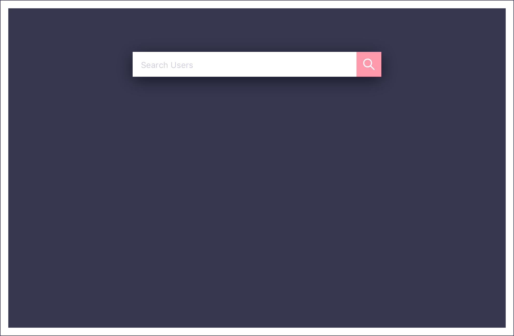
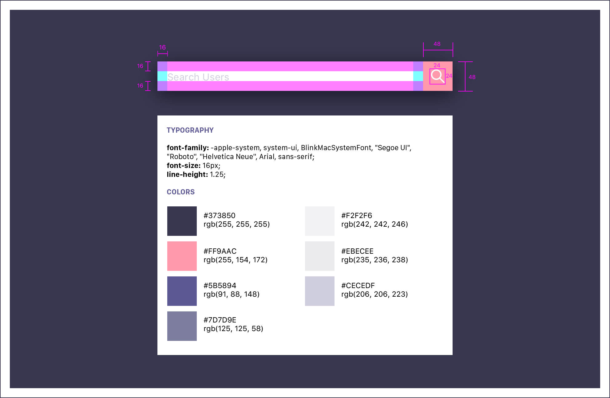
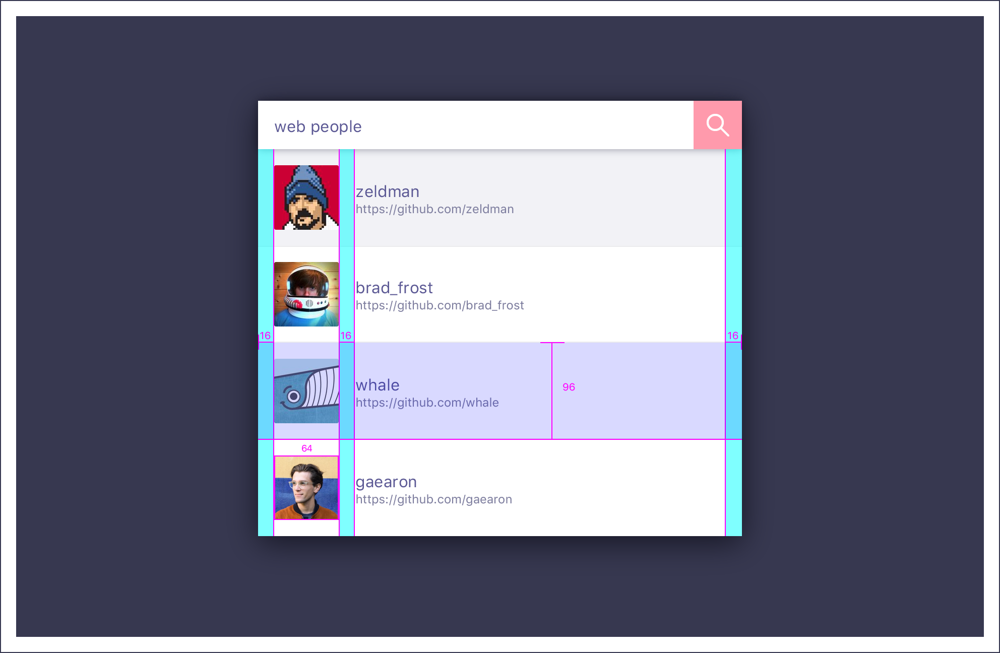
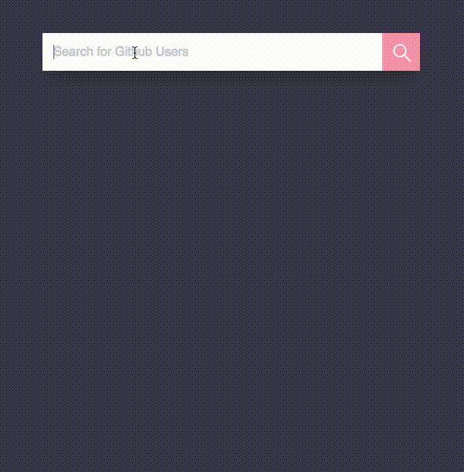

# Front End Interview Quesiton

The assignment is to develop an AutoComplete component for searching Github Users. The assignment has two discrete parts, one focusing on component structure and styling, the other on functionality.

## Part I

Given the following design specs and starter files, generate the necessary component structure and styles. It is ok to incorporate any additional tooling or libraries to achieve the design using your prefered approach. You can use the fake-results.json file as a mock response for user search results.

 

- - - - - - - - -

## Part II

Integrate with the Github v3 REST API for searching Github Users. 

__As one types into the search field, query Github for matching users and populate a list showing the Github User's avatar, login, and link to the User's Github page.__

https://developer.github.com/v3/search/#search-users

- - - - - - - - -

## Part III

Please include notes on your implementation, outlining your development choices and approach. Let us know your thoughts on what you would consider for future enhancements.

 
 

# Getting Started with Create React App

This project was bootstrapped with [Create React App](https://github.com/facebook/create-react-app).

## Available Scripts

In the project directory, you can run:

### `npm start`

Runs the app in the development mode.\
Open [http://localhost:3000](http://localhost:3000) to view it in your browser.

The page will reload when you make changes.\
You may also see any lint errors in the console.

### `npm test`

Launches the test runner in the interactive watch mode.\
See the section about [running tests](https://facebook.github.io/create-react-app/docs/running-tests) for more information.

### `npm run build`

Builds the app for production to the `build` folder.\
It correctly bundles React in production mode and optimizes the build for the best performance.

The build is minified and the filenames include the hashes.\
Your app is ready to be deployed!

See the section about [deployment](https://facebook.github.io/create-react-app/docs/deployment) for more information.

# github_search
